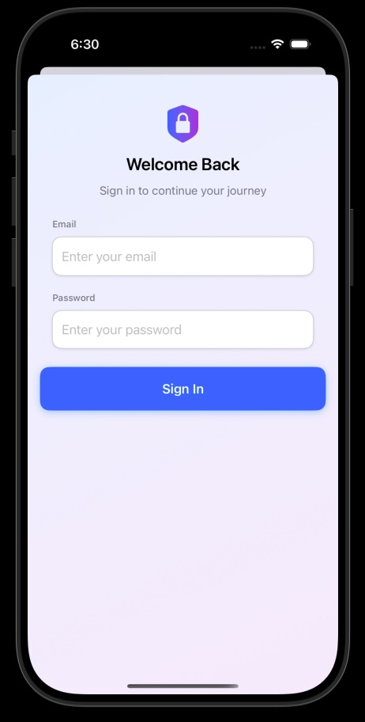

# BlogPost iOS App

An iOS application that allows users to register, log in, and manage blogs with co-owner functionality. Built with SwiftUI using MVVM architecture, this app demonstrates clean architecture, API integration, secure authentication, and automated testing.

## 🚀 Features

### Dashboard
- Displays all blogs with **Login** and **Register** buttons.

### Authentication
- Any user can register and log in (no verification flow).
- JWT authentication for all secured endpoints.

### Blog Management
- Add, edit, and delete blogs after login.
- Add a co-owner from the user list.
- Any co-owner can also edit or delete the blog.

### Architecture
- Built using **MVVM** for separation of concerns.

### Networking
- **Alamofire** for API calls.
- **Codable** for parsing API responses.
- **APIClient** as the common gateway for all API requests.
- **BlogService** and **UserService** for domain-specific API logic.

### Authentication
- Login state handled with **AuthManager**.
- Secure token storage with **KeychainHelper**.

### Testing
- Unit Tests for models and API response decoding.
- UI Tests for login/logout flow and navigation.

## 📱 App Screenshots

| Login | Dashboard |
|:------:|:----------:|
|  |  |

| Register | Add / Edit Blog |
|:----------:|:----------------:|
|  |  |

## 🛠️ Tech Stack
- SwiftUI for UI
- MVVM architecture
- Alamofire for networking
- Codable for JSON parsing
- Keychain for secure token storage
- XCTest for Unit & UI testing

## 📂 Project Structure
```

BlogPost_iOSApp/
│── App/               # Main App entry
│── Models/            # Blog, User, API response models
│── Services/          # BlogService, UserService, APIClient
│── Networking/        # APIClient, Endpoint, APIError
│── ViewModels/        # MVVM layer managing state & logic
│── Views/             # SwiftUI Views (Dashboard, Login, Register, BlogForm)
│── Managers/          # AuthManager, KeychainHelper
│── Tests/             # Unit tests
│── UITests/           # UI tests
│── README.md          # Project documentation

````

## 🔑 Authentication
- JWT tokens are stored securely in Keychain.
- All API calls requiring authentication attach the token automatically.

## 🧪 Testing
- **Unit Tests:** Verify model decoding and authentication logic.
- **UI Tests:** Validate login/logout flow, navigation to Dashboard, and button accessibility identifiers.

## 📦 API
- Backend APIs are hosted on **Render Cloud**:
  - Blog CRUD endpoints
  - User authentication & registration
  - Co-owner management

## ▶️ Getting Started
1. Clone the repository:  
```bash
git clone https://github.com/shuvojoseph/BlogPost_iOSApp.git
````

2. Install dependencies (CocoaPods):

```bash
pod install
```

3. Open in Xcode:

```bash
open BlogPost_iOSApp.xcodeproj
```

4. Run on iOS Simulator or a real device.

## Dependency Injection

* BlogService is now **injected** into view models (`BlogListViewModel`, `AddEditBlogViewModel`, `BlogDetailViewModel`) instead of being accessed as a singleton directly.
* AuthManager and APIClient remain singletons since they are globally shared managers.
* This demonstrates understanding of **Dependency Injection (DI)** and makes it easier to write unit tests or replace services in the future.

## Backend Notes

* The backend is hosted on Render and may go inactive after ~45 minutes of inactivity.
* If the backend is inactive, it may take ~2 minutes to start again.
* To activate the backend before using the app, open this link in a browser:
  [https://blogpostspringboot.onrender.com/api/blogs](https://blogpostspringboot.onrender.com/api/blogs)
* Once the backend is active, you can use the mobile app to fetch or post blogs.
